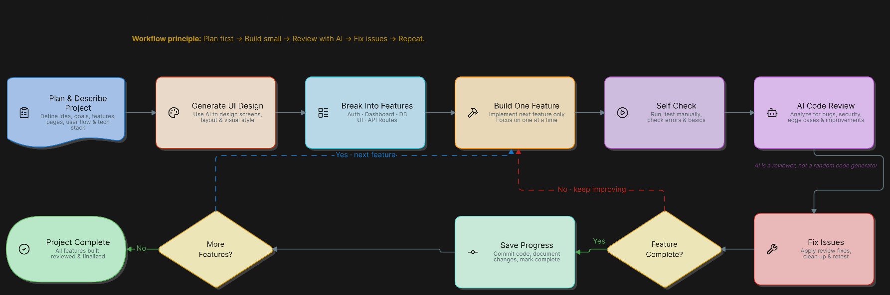

# AI Workflow

## Development Loop

[](https://app.eraser.io/workspace/G8EpIWj7GwrSKfuByKA6)

The workflow principle is: **Plan first → Build small → Review with AI → Fix issues → Repeat.**

### 1. Plan & Describe Project

For complex work, use `/plan` to interview about the product, users, scope,
user flows, architecture, risks, and constraints. Do not write code during the
interview. Small, well-defined changes may skip `/plan`, but every
implementation still needs a GitHub issue.

### 2. Generate UI Design

When the project has a user interface, use the `/ui-design-prompt` skill after
the plan is complete to turn `@plan.md` into a ready-to-paste image-generation
prompt. Include the target aspect ratio, for example:

```text
/ui-design-prompt @plan.md --aspect-ratio 16:9
```

Paste the generated prompt into an AI image-generation tool to explore screens,
layouts, visual style, and user flows. Save the selected generated design as
`design/image.png`; this file is the canonical visual reference used during
implementation. Review the generated design before breaking the work into
implementation issues. Skip this step for backend, CLI, library, documentation,
and other work without a UI.

### 3. Break Into Features

Turn the project plan into small, independently verifiable features. Create or
update GitHub issues with scope, dependencies, expected files or modules,
acceptance criteria, and out-of-scope work. Use `/create-issue` for new issues
and `/whats-next` to select a ready issue.

### 4. Build One Feature

Create the issue branch and worktree, then run `/start-issue` inside the
checkout. Implement only the current feature and follow `AGENTS.md` and
`docs/conventions.md`. Keep the change small and complete rather than building
multiple features at once.

### 5. Self Check

Run the relevant checks while implementing, normally:

```sh
pnpm run check
```

Review the diff, test observable behavior, and confirm the feature matches its
acceptance criteria before requesting review.

### 6. AI Code Review

Use AI to review the implementation for bugs, security issues, missing tests,
edge cases, convention violations, and unnecessary changes. For risky,
complex, or security-sensitive work, use a fresh read-only reviewer that did
not implement the change.

AI is a reviewer, not a random code generator.

### 7. Fix Issues

Apply valid review findings, clean up the implementation, and rerun the
relevant checks. Do not make unrelated improvements during this loop.

### 8. Feature Complete?

The feature is complete only when its acceptance criteria are satisfied, tests
and checks pass, the final diff is in scope, and review findings are addressed.
If it is not complete, return to **Build One Feature** or **Fix Issues**.

### 9. Save Progress

Run `/finish-issue` to revalidate the issue, update only affected
documentation, run `pnpm run verify`, audit the final diff, and create the
Conventional Commit. Run `/prepare-pr` to verify the branch and create the pull
request after confirmation. The PR must link the issue with `Closes #<issue>`.

After CI passes and approval is complete, a human squash-merges the PR and
removes the worktree.

### 10. More Features?

If more features remain, select the next ready issue and repeat from
**Build One Feature**. Use parallel development only for independent features;
use separate Worktrunk worktrees and agent sessions to prevent collisions.

If no features remain, verify the complete project and proceed to
**Project Complete**.

### 11. Project Complete

The project is complete when all planned features are built, reviewed,
verified, documented where needed, and delivered through the issue and pull
request workflow.

Use `/retry-issue` only when an attempt or issue definition is unsatisfactory;
it requires confirmation before discarding changes.

## Execution Setup

Local development:

```text
VS Code → herdr multiplexer → Worktrunk worktree → agent AI
```

Remote development:

```text
VS Code Remote SSH → herdr multiplexer → Worktrunk worktree → agent AI
```

Use `herdr` from the VS Code terminal. Worktrunk creates and manages the
isolated worktree where the agent runs.

## Worktrees and Agents

Use [Worktrunk](https://worktrunk.dev/) to create the checkout and launch an
agent from the VS Code terminal:

```sh
wt switch --create <branch>
wt claude --create <branch>
wt codex --create <branch>
wt copilot --create <branch>
wt opencode --create <branch>
```

Name branches according to [`conventions.md`](conventions.md). Each issue owns
one branch, worktree, primary agent session, and pull request. A worktree
isolates Git state, not system access, so run unrestricted agents only in an
isolated environment without host credentials or unrelated files.

## Environment

The committed [`.envrc`](../.envrc) loads worktree-local `.env` files and
exposes existing `.venv` and `node_modules/.bin` directories. mise remains
activated by the shell.

After installing the shell hook, approve each checkout:

```sh
direnv allow
```

## Development Modes

Use **parallel development** when features are independent and can be safely
worked on at the same time. Give each issue its own Worktrunk worktree and agent
session:

```text
issue A → worktree A → agent A
issue B → worktree B → agent B
```

Use **sequential development** when features depend on one another, the change
is small, or shared context is important. Finish and verify one issue before
starting the next in a single checkout:

```text
issue A → implement → verify → PR
issue B → implement → verify → PR
```

In both modes, keep one issue, branch, worktree, agent session, and pull
request together.
