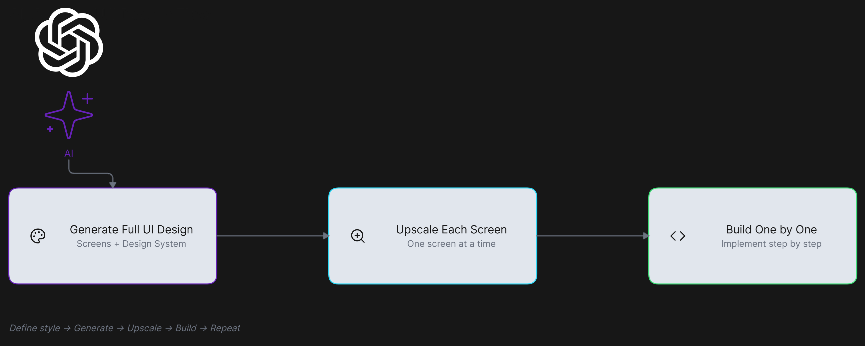
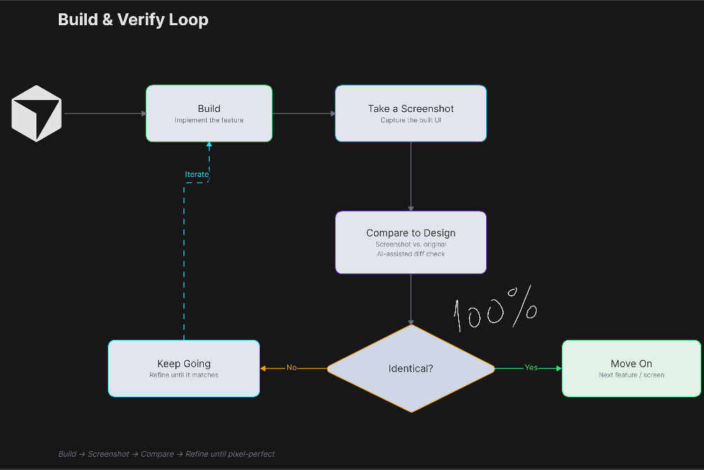

# Workflows

[](https://app.eraser.io/workspace/G8EpIWj7GwrSKfuByKA6)

The development loop is: **Plan → Generate UI Design → Break Into Features →
Build One Feature → Self Check → Open PR → AI Code Review → Fix Issues →
Deliver.** Every implementation requires a GitHub issue.

## 1. Plan & Describe Project

For complex work, use `/project-plan` to define the product, users, scope,
flows, architecture, risks, and constraints. Approve the result and save it as
`plan.md`. Small, well-defined changes may skip the interview.

## 2. Generate UI Design

Skip this step for work without a user interface. Use AI to design the screens,
layout, and visual style. Generate a prompt from the completed plan:

```text
/ui-design-prompt @plan.md --aspect-ratio 16:9
```

Paste it into an image-generation tool. Generate one 16:9 overview with every
planned page shown as a panel in a shared design system. Save the approved image
as `design/panels.png`; it is the canonical design reference.



Prepare every panel before creating implementation issues:

1. Expand the complete panel to full resolution and save it as
   `design/<page-name>-reference.png`.
2. Remove its UI elements and save the remaining full-screen background as
   `design/<page-name>-background.png`.
3. Repeat until every panel has both assets.

## 3. Break Into Features

Use `/create-issue` to split the plan into verifiable features. For UI, create
one issue per page or flow with its design assets, target, and acceptance
criteria. Use `/whats-next` to select a ready issue.

## 4. Build One Feature

Create the issue branch and worktree, enter the agent's `/plan` mode, then run
`/start-issue` to prepare a focused implementation plan. Approve the plan and
leave planning mode before editing. Implement only the selected feature and
follow `AGENTS.md` and `docs/conventions.md`.

For a UI page, run:

```text
/ui-implementation-loop <page-name>
```

The skill implements the UI in code over the prepared background, captures the
page at the target viewport, compares it with its full-resolution reference,
and refines it until its acceptance criteria pass.



## 5. Self Check

Run checks while implementing:

```sh
pnpm run check
```

For UI work, confirm the screenshot meets the approved visual, functional,
responsive, and accessibility criteria. **Identical** does not require literal
pixel equality when a difference is justified. Review the diff and observable
behavior before requesting review.

## 6. Open the Pull Request

Run `/finish-issue` to revalidate the issue, update affected documentation, run
`pnpm run verify`, audit the diff, and create the Conventional Commit. Then run
`/prepare-pr` to verify the branch and create a pull request containing
`Closes #<issue>`.

## 7. AI Code Review

CodeRabbit reviews the pull request for bugs, security issues, missing tests,
edge cases, convention violations, and unnecessary changes.

## 8. Fix Issues

Apply valid findings, rerun the relevant checks, and push the fixes. Repeat the
CodeRabbit review loop until all findings are resolved or explicitly addressed.

## 9. Finish and Deliver

After CI passes, CodeRabbit findings are resolved, and approval is complete, a
human squash-merges the pull request and removes the worktree.

If features remain, use `/whats-next` and return to **Build One Feature**. The
project is complete when all planned features are implemented, reviewed,
verified, documented, and delivered. Use `/retry-issue` only when an attempt or
issue definition is unsatisfactory; it requires confirmation before discarding
changes.

## Sources of Truth

- `AGENTS.md`, conventions, and architecture documentation define repository
  constraints and technical decisions.
- The `GitHub issue` defines scope, behavior, target platform, viewport, states,
  and acceptance criteria.
- `design/panels.png` defines the approved cross-page design, while
  `design/<page-name>-reference.png` defines the detailed visual target.
- Tests and required checks define executable verification and protect existing
  behavior.
- `design/<page-name>-background.png` and other generated assets support the
  implementation; they are not references.

Validate against the issue, visual target, and tests. If they conflict, preserve
repository constraints and functional or accessibility requirements, then
report the conflict instead of guessing.
