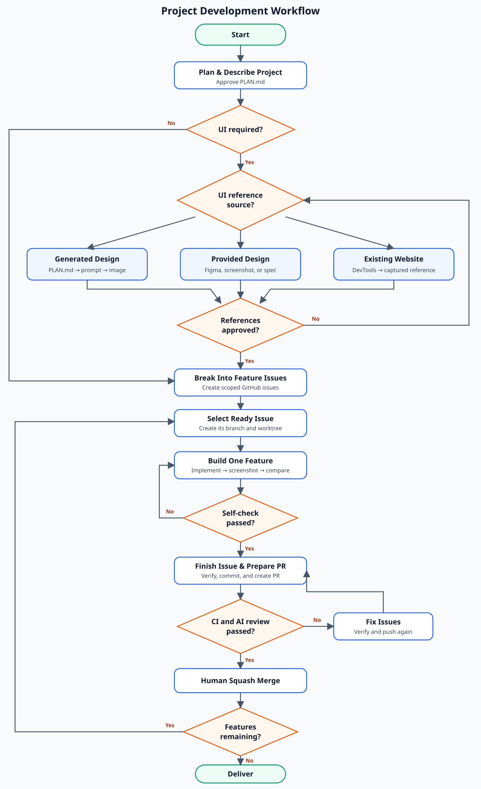

# Workflows



The development loop is: **Plan → UI Design → Break Into Features → Build One
Feature → Self Check → Open PR → AI Code Review → Fix Issues → Deliver.** Every
implementation requires a GitHub issue.

The named slash commands are committed Claude Code extensions. When using a
different agent, perform the equivalent step described in this document.

## 1. Plan & Describe Project

For complex work, use [`/project-plan`](../.claude/commands/project-plan.md) to
define the product, users, scope, flows, architecture, risks, and constraints.
Approve the result and save it as `PLAN.md`. Small, well-defined changes may
skip the interview.

## 2. UI Design

Skip this step for work without a user interface. Choose one source for the UI
references:

### Generated Design

Generate a prompt from the completed plan with the
[`/ui-design-prompt`](../.claude/skills/ui-design-prompt/SKILL.md) skill:

```text
/ui-design-prompt @PLAN.md --aspect-ratio 16:9
```

Paste it into an image-generation tool. Generate one 16:9 overview with every
planned page shown as a panel in a shared design system. Save the approved image
as `design/panels.png`; it is the canonical design reference.


### Provided Design

Use a Figma frame or export, screenshot, mockup, or design-system specification
provided by the user. Confirm which artifact applies to each page, viewport,
and state. Export complete page references when the provided design does not
already include them.

### Existing Website

For an authorized existing website, use browser or Chrome DevTools tooling to
inspect only the permitted pages and capture complete references at the
required desktop and mobile viewports. Record the states and interactions that
the implementation must preserve. Do not copy source code or reuse proprietary
branding, text, imagery, fonts, or other assets without permission.

### Prepare References

Every source must produce approved references before creating implementation
issues:

1. Save each complete page as
   `design/<page-name>-reference.png`.
2. Save any authorized artwork, textures, icons, or images required by the
   implementation under `design/assets/`.
3. Add viewport or state suffixes when multiple references would otherwise
   collide.

## 3. Break Into Features

Use [`/create-issue`](../.claude/skills/create-issue/SKILL.md) to split the plan
into verifiable features. For UI, create one issue per page or flow with its
design assets, target, and acceptance criteria. Use
[`/whats-next`](../.claude/commands/whats-next.md) to select a ready issue.

## 4. Build One Feature

Create the issue branch and worktree, enter the agent's `/plan` mode, then run
[`/start-issue`](../.claude/skills/start-issue/SKILL.md) to prepare a focused
implementation plan. Approve the plan and leave planning mode before editing.
Implement only the selected feature and follow [`AGENTS.md`](../AGENTS.md) and
[the conventions](conventions.md).

For a UI page, run the
[`/ui-implementation-loop`](../.claude/skills/ui-implementation-loop/SKILL.md)
skill with the approved reference:

```text
/ui-implementation-loop <page-name>
```

The skill implements original UI code, captures the local page at matching
viewports, compares it with the full reference, and refines it until the
acceptance criteria pass.

Use
[`/replicate-web-ui`](../.claude/skills/replicate-web-ui/SKILL.md) as the direct
entry point when an existing website is the reference; it selects the existing
website mode of `/ui-implementation-loop` and may re-inspect the authorized
target while implementing its captured reference.


## 5. Self Check

Run checks while implementing:

```sh
pnpm run check
```

For UI work, confirm the screenshot meets the approved visual, functional,
responsive, and accessibility criteria. **Identical** does not require literal
pixel equality when a difference is justified. Review the diff and observable
behavior before requesting review.

## 6. Open the Pull Request

Run [`/finish-issue`](../.claude/skills/finish-issue/SKILL.md) to revalidate the
issue, update affected documentation, run `pnpm run verify`, audit the diff,
and create the Conventional Commit. Then run
[`/prepare-pr`](../.claude/skills/prepare-pr/SKILL.md) to verify the branch and
create a pull request containing `Closes #<issue>`.

## 7. AI Code Review

After [automatic AI review is configured](repository-settings.md#automatic-ai-review),
CodeRabbit reviews the pull request for bugs, security issues, missing tests,
edge cases, convention violations, and unnecessary changes.

## 8. Fix Issues

Apply valid findings, rerun the relevant checks, and push the fixes. Repeat the
CodeRabbit review loop until all findings are resolved or explicitly addressed.

## 9. Finish and Deliver

After CI passes, CodeRabbit findings are resolved, and approval is complete, a
human squash-merges the pull request and removes the worktree.

If features remain, use [`/whats-next`](../.claude/commands/whats-next.md) and
return to **Build One Feature**. The project is complete when all planned
features are implemented, reviewed, verified, documented, and delivered. Use
[`/retry-issue`](../.claude/skills/retry-issue/SKILL.md) only when an attempt or
issue definition is unsatisfactory; it requires confirmation before discarding
changes.

## Sources of Truth

- `AGENTS.md`, conventions, and architecture documentation define repository
  constraints and technical decisions.
- The `GitHub issue` defines scope, behavior, target platform, viewport, states,
  and acceptance criteria.
- `design/panels.png` defines the approved cross-page design, while
  `design/<page-name>-reference.png` defines the detailed visual target.
- Tests and required checks define executable verification and protect existing
  behavior.
- Files under `design/assets/` support the implementation; they are not visual
  references.

Validate against the issue, visual target, and tests. If they conflict, preserve
repository constraints and functional or accessibility requirements, then
report the conflict instead of guessing.
